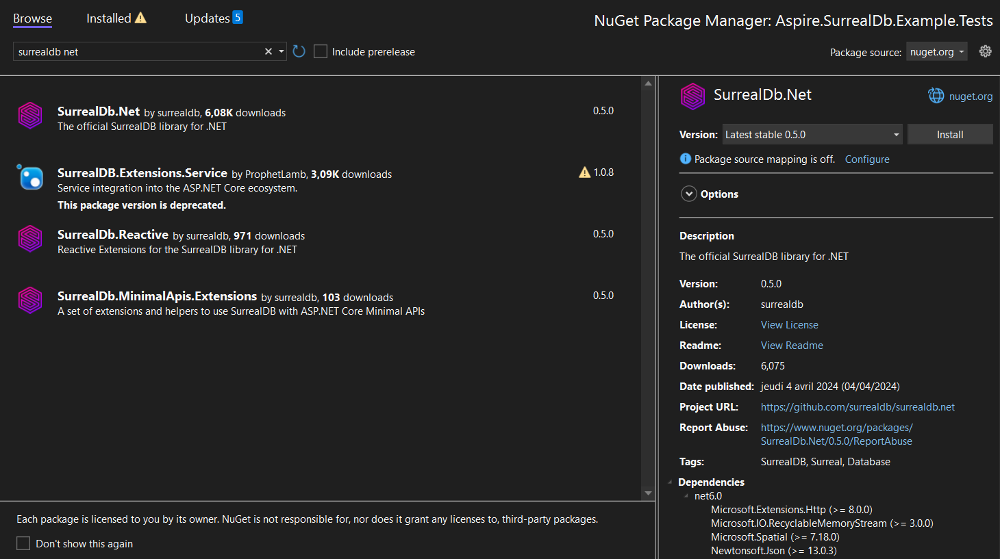

{/* let x = "0.5.0";

fetch('https://api.nuget.org/v3/registration5-gz-semver2/surrealdb.net/index.json').then(); */}

# Getting started

Before you can use this SDK in your .NET applications regardless of your environment, you need to install and import it into your project.
This guide will walk you through the process of installing and importing the SDK into your project.

## Install the SDK

- Create a new project using your favorite IDE (Visual Studio, JetBrains Rider, etc...) 
- or use an existing template from the <code>dotnet new</code> command.

Once ready, add the SurrealDB SDK to your dependencies:

import Tabs from "@theme/Tabs";
import TabItem from "@theme/TabItem";
import CodeBlock from '@theme/CodeBlock';
import { packageName, fetchNugetVersion } from './utils';

export const value = await fetchNugetVersion();

<Tabs groupId="dotnet-package-manager">
  <TabItem value="dotnet-cli" label=".NET CLI" default>

```bash
dotnet add package SurrealDb.Net
```

  </TabItem>
  <TabItem value="package-reference" label="PackageReference">
    <CodeBlock language="xml">
        {`<PackageReference Include="${packageName}" Version="${value}" />`}
    </CodeBlock>
  </TabItem>
</Tabs>

<br />

Alternatively, you can install the SDK via the NuGet user interface provided in your IDE.
Here is an example within Visual Studio:



## Initialize the SDK

The SDK's initialization may vary depending on the context of your project.

The de facto initialization method is to create and [consume a SurrealDbClient created manually](/docs/sdk/dotnet/core/initialization).
Most .NET projects provide a way to configure services using [Dependency Injection](/docs/sdk/dotnet/dependency-injection), which is the recommended way to use the SDK in your application.
