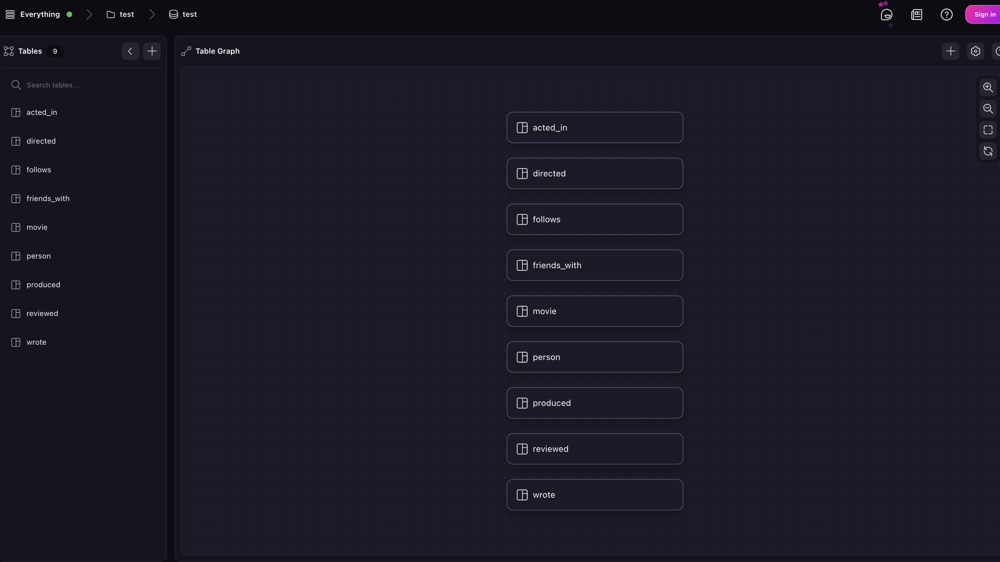
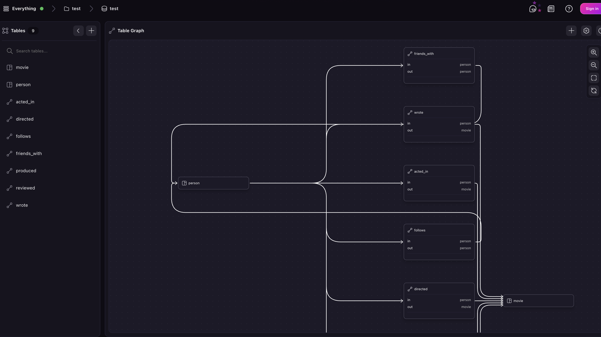

# Neo4J

## Supported data types

Neo4J data types are either fully supported via direct conversion, or partially supported via an object that maintains the information in the original type. For more on these data types, see [the project repository](https://github.com/surrealdb/surreal-sync/blob/main/docs/neo4j-data-types.md).

## Import example

Log in to Neo4J, start server with user `neo4j` and password `password`, then run the following queries:

```surql title="Sample Neo4J data"
CREATE (a:Person {name: 'Alice', age: 29})
CREATE (b:Person {name: 'Bob', age: 35})
CREATE (c:Person {name: 'Charlie', age: 40})
CREATE (a)-[:FRIENDS_WITH]->(b)
CREATE (b)-[:FRIENDS_WITH]->(c)
```

Next, start a surrealdb server with the command `surreal start --user root --pass root`.

Then run the following command to import the data to SurrealDB:

```
surreal-sync sync
neo4j \
  --source-uri "bolt://localhost:7687" \
  --source-username "neo4j" \
  --source-password "password" \
  --to-namespace "test" \
  --to-database "test"
```

Log in to SurrealDB under namespace `test` and database `test`, use `SELECT *, friends_with->person AS friends FROM person` statement to see imported data:

```surql title="Result"
[
	{
		age: 29,
		friends: NONE,
		id: person:0,
		labels: [
			'Person'
		],
		name: 'Alice',
		neo4j_id: 0
	},
	{
		age: 35,
		friends: NONE,
		id: person:1,
		labels: [
			'Person'
		],
		name: 'Bob',
		neo4j_id: 1
	},
	{
		age: 40,
		friends: NONE,
		id: person:2,
		labels: [
			'Person'
		],
		name: 'Charlie',
		neo4j_id: 2
	}
]
```

## After migration

After a migration is done, you may want to add a schema. As SurrealDB is schemaless by default, tables will be declared with the `DEFINE TABLE <table_name> TYPE ANY SCHEMALESS PERMISSIONS NONE`. For example, if [this sample movie database](https://github.com/neo4j-graph-examples/movies/blob/main/scripts/movies.cypher) is imported, the Surrealist Designer view will simply show nine table names with no specified relation.



Note that the graph relations have already been set up; they just have not been strictly defined in the schema.

```surql
SELECT 
	name, 
	->wrote->movie.title AS wrote 
FROM person
ORDER BY name;

-- Output
[
	{
		name: 'Aaron Sorkin',
		wrote: [
			'A Few Good Men'
		]
	},
	{
		name: 'Al Pacino',
		wrote: []
	},
	{
		name: 'Alice',
		wrote: []
	},
	// and so on
]
```

To begin setting a schema, you can use this sort of query to see exactly which relations exist.

```surql
-- Get every type and destination of links from `person`, flatten into
-- a single array, remove duplicates
(SELECT VALUE ->?.{
    val: id.tb() + '->' + out.tb()
} FROM person).flatten().map(|$v| $v.val).distinct();
```

```surql
[
	'friends_with->person',
	'acted_in->movie',
	'directed->movie',
	'produced->movie',
	'wrote->movie',
	'follows->person',
	'reviewed->movie'
]
```

This information can now be used to overwrite the existing loose definitions into concrete `RELATION` tables with a specified `in` and `out`.

```surql
DEFINE TABLE OVERWRITE friends_with TYPE RELATION IN person OUT person;
DEFINE TABLE OVERWRITE follows TYPE RELATION IN person OUT person;

DEFINE TABLE OVERWRITE acted_in TYPE RELATION IN person OUT movie;
DEFINE TABLE OVERWRITE directed TYPE RELATION IN person OUT movie;
DEFINE TABLE OVERWRITE wrote TYPE RELATION IN person OUT movie;
DEFINE TABLE OVERWRITE follows TYPE RELATION IN person OUT person;
DEFINE TABLE OVERWRITE reviewed TYPE RELATION IN person OUT movie;
DEFINE TABLE OVERWRITE produced TYPE RELATION IN person OUT movie;
```


