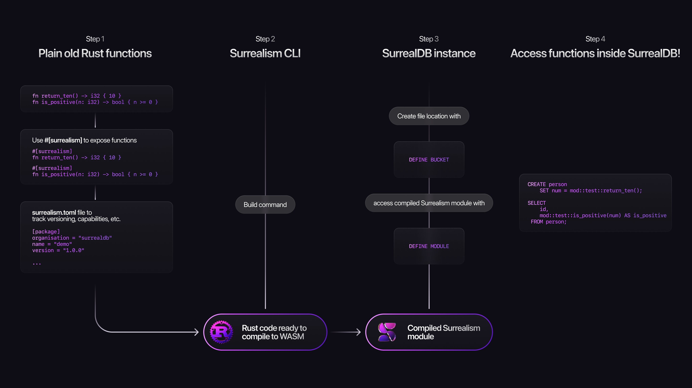

# Surrealism

Surrealism is a plugin feature introduced in SurrealDB 3.0 which allows users to write code that can then be compiled to Web Assembly and accessed inside a running SurrealDB instance.

> [!NOTE]
> Surrealism is currently in active development and is not yet stable. We are looking forward to any and all feedback on the plugin system, either via raising an issue or PR on the SurrealDB repo, or anywhere else in the [SurrealDB community](https://discord.gg/surrealdb).

Surrealism was built in order to allow users to extend SurrealDB in ways that benefit them, without needing to make any changes to the code of SurrealDB itself. Some potential use cases are:

* Adding functions to create fake / mock data for testing.
* Accessing functionality in Rust crates that are too specific to merge into SurrealDB itself, such as [language-specific functionality](https://crates.io/crates/hangeul), [custom case conversions](https://docs.rs/convert_case/latest/convert_case/enum.Case.html), or [quantitative finance](https://docs.rs/crate/RustQuant/latest).
* Anything else you have built in your own code that you would like to access inside SurrealDB.

## How Surrealism works

Surrealism works by using the following steps:

* The addition of a `surrealism.toml` file plus the `#[surrealism]` annotation over functions to expose.
* A CLI that compiles this code into a WASM binary.
* Statements inside SurrealDB to [allow access to the file](/docs/surrealql/statements/define/bucket) and to [define a module](/docs/surrealql/statements/define/module) holding the functions.

The next page contains a walkthrough to show how this process works.
