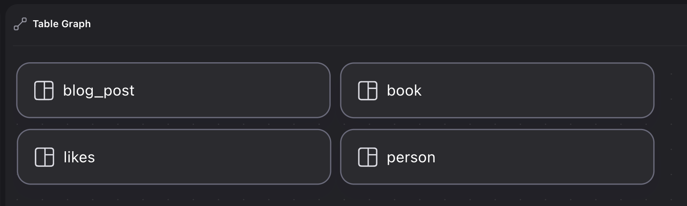
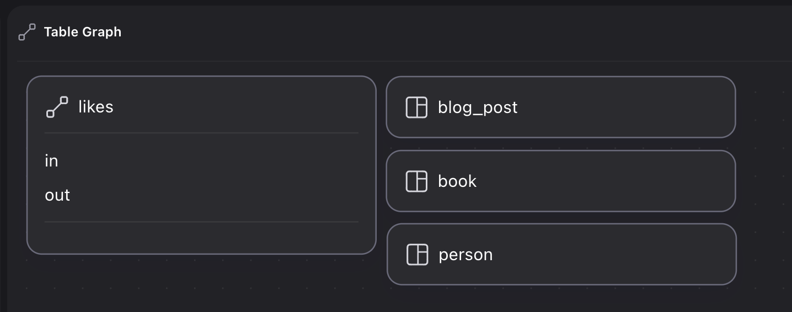
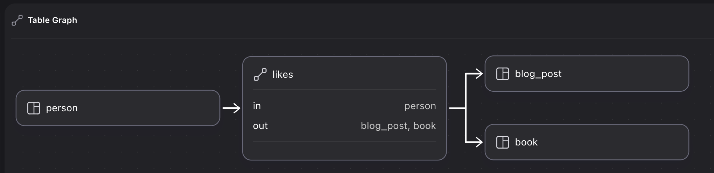

# Graph relations

In SurrealDB, one record can be linked to another via a graph edge, namely a table that stands in between the two that has its own ID and properties. This page teaches how to determine whether this is the ideal way to link records in your project, and best practices for doing so.

## When to use graph relations

The first item to take into account when using graph relations is whether they are the right solution in the first place, because graph edges are not the only way to link one record to another.

SurrealDB has two main ways to create relations between one record and another: record links, and graph relations.

A record link is a simple pointer from one record to another, a link that exists any time a record holds the record ID of another record. Record links are extremely efficient because record IDs are direct pointers to the data of a record, and do not require a table scan.

Take the following example that creates one `user` who has written two `comment`s.

```surql
LET $new_user = CREATE ONLY user SET name = "User McUserson";
-- Create a new comment, use the output to update the user
UPDATE $new_user SET comments += (CREATE ONLY comment SET 
    text = "I learned something new!", 
    created_at = time::now())
    .id;
UPDATE $new_user SET comments += (CREATE ONLY comment SET
    text = "I don't get it, can you explain?",
    created_at = time::now())
    .id;
```

Querying a record link is easy as the link by default is unidirectional with nothing in between. In this case, the linked comments are simply a field on a `user` record and accessing them is as simple as any other field on a `user` record.

```surql
SELECT 
    name, 
    comments.{ created_at, text }
FROM user;
```

```surql title="Output"
[
	{
		comments: [
			{
				created_at: d'2024-12-12T02:39:07.644Z',
				text: 'I learned something new!'
			},
			{
				created_at: d'2024-12-12T02:39:07.645Z',
				text: "I don't get it, can you explain?"
			}
		],
		name: 'User McUserson'
	}
]
```

Until SurrealDB version 2.2.0, record links were strictly unidirectional. The only way to query in the other direction was by using a subquery, which made graph edges the only easy option for bidirectional links.

```surql
SELECT 
    *,
    -- Check the `user` table's `comments` field
    -- for the id of the current comment
    (SELECT id, name FROM user WHERE $parent.id IN comments) AS author
FROM comment;

-- Equivalent graph query is much easier
-- to read and write
SELECT 
	*,
	<-wrote<-author
FROM comment;
```

```surql
[
	{
		author: [
			{
				id: user:f3t90z8uvns76sr3nxrd,
				name: 'User McUserson'
			}
		],
		created_at: d'2024-12-12T02:39:07.645Z',
		id: comment:gj1vtsd9d19z9afrc14j,
		text: "I don't get it, can you explain?"
	},
	{
		author: [
			{
				id: user:f3t90z8uvns76sr3nxrd,
				name: 'User McUserson'
			}
		],
		created_at: d'2024-12-12T02:39:07.644Z',
		id: comment:zhnbfopxspekknsi6vx6,
		text: 'I learned something new!'
	}
]
```

Since version 2.2.0, a record link can be bidirectional by [defining a field](/docs/surrealql/statements/define/field) with the `REFERENCE` clause, allowing referenced records to define a field or use the `.refs()` method to track incoming references.

```surql
DEFINE FIELD comments ON user TYPE option<array<record<comment>>> REFERENCE;
DEFINE FIELD author ON comment TYPE references;

LET $new_user = CREATE ONLY user SET name = "User McUserson";
-- Create a new comment, use the output to update the user
UPDATE $new_user SET comments += (CREATE ONLY comment:one SET 
    text = "I learned something new!", 
    created_at = time::now())
    .id;
UPDATE $new_user SET comments += (CREATE ONLY comment:two SET
    text = "I don't get it, can you explain?",
    created_at = time::now())
    .id;

-- 'author' field is populated with the 'user' who wrote the comment
SELECT * FROM ONLY comment:one;
-- Or use .refs() to grab the references
comment:one.refs();
```

```surql title="Output"
-------- Query --------

{
	author: [
		user:ie8yc8woe0rwo5cgln57
	],
	created_at: d'2024-12-31T04:51:47.504Z',
	id: comment:one,
	text: 'I learned something new!'
}

-------- Query --------

[
	user:ie8yc8woe0rwo5cgln57
]
```

If your use case involves bidirectional links, consider the following items to make a decision.

Record links are preferred if:

* Performance is of the utmost importance.
* You don't need to put complex queries together.
* You want to specify in the schema what behaviour should take place when a linked record is deleted (cascade delete, refuse to delete, ignore, etc.).

Graph links are preferred if:

* You want to quickly create links without touching the database schema, or among multiple record types. For example, a single `RELATE person:one->wrote->[blog:one, book:one, comment:one]` is enough to create links between a `person` and three other record types, whereas using record links may be a more involved process involving several `DEFINE FIELD` statements.
* You want to put together complex queries that take advantage of SurrealQL's expressive arrow syntax, like `->wrote->comment<-wrote<-person->wrote->comment FROM person`.
* You want to visualize your schema using Surrealist's designer view.

Finally, graph links are not just preferred but almost certainly necessary if you need to keep metadata about the context in which a link is created. Take the following metadata for the examples above involving a user and its comments which contains information about a user's current location, operating system, and mood. Where does this data belong?

```surql
{
    location: "Arizona",
    os: "Windows 11",
    current_mood: "Happy"
}
```

This metadata isn't information about the user as a whole, nor the comment itself. It's information about the moment in time in which the `user` and `comment` were linked, and thus is best stored in a separate table.

Or you might have some information about the link itself, which would also belong nowhere else but inside a graph table.

```surql
{
	friends_since: d'2024-12-31T06:43:21.981Z',
	friendship_strength: 0.4
}
```

Graph links also excel when it comes to weighting relations. This can be done through a field on the graph table...

```surql
-- Create 4 'npc' records
CREATE |npc:1..4|;

FOR $npc IN SELECT * FROM npc {
    -- Give each npc 20 random interactions
    FOR $_ IN 0..20 {
      -- Looks for a random NPC, use array::complement to filter out self
      LET $counterpart = rand::enum(array::complement((SELECT * FROM npc), [$npc]));
      -- See if they have a relation yet
      LET $existing = SELECT * FROM knows WHERE in = $npc.id AND out = $counterpart.id;
      -- If relation exists, increase 'greeted' by one
      IF !!$existing {
        UPDATE $existing SET greeted += 1;
      -- Otherwise create the relation and set 'greeted' to 1
      } ELSE {
        RELATE $npc->knows->$counterpart SET greeted = 1;
      }  
    };
};

SELECT 
	id, 
	->knows.{ like_strength: greeted, with: out } AS relations
	FROM npc;
```

```surql title="Which NPC each NPC likes the most"
[
	{
		id: npc:1,
		relations: [
			{
				like_strength: 8,
				with: npc:3
			},
			{
				like_strength: 8,
				with: npc:4
			},
			{
				like_strength: 4,
				with: npc:2
			}
		]
	},
	{
		id: npc:2,
		relations: [
			{
				like_strength: 10,
				with: npc:1
			},
			{
				like_strength: 4,
				with: npc:3
			},
			{
				like_strength: 6,
				with: npc:4
			}
		]
	},
	{
		id: npc:3,
		relations: [
			{
				like_strength: 6,
				with: npc:2
			},
			{
				like_strength: 3,
				with: npc:4
			},
			{
				like_strength: 11,
				with: npc:1
			}
		]
	},
	{
		id: npc:4,
		relations: [
			{
				like_strength: 7,
				with: npc:1
			},
			{
				like_strength: 6,
				with: npc:3
			},
			{
				like_strength: 7,
				with: npc:2
			}
		]
	}
]
```

...or through counting the number of edges.

```surql
-- Create 4 'npc' records
CREATE |npc:1..4|;

FOR $npc IN SELECT * FROM npc {
    -- Give each npc 20 random interactions
    FOR $_ IN 0..20 {
      -- Looks for a random NPC, use array::complement to filter out self
      LET $counterpart = rand::enum(array::complement((SELECT * FROM npc), [$npc]));
      RELATE $npc->greeted->$counterpart;
    };
};

SELECT 
	count() AS like_strength, 
	in AS npc, 
	out AS counterpart
FROM greeted
GROUP BY npc, counterpart;
```

```surql title="Which NPC each NPC likes the most"
[
	{
		counterpart: npc:2,
		like_strength: 6,
		npc: npc:1
	},
	{
		counterpart: npc:3,
		like_strength: 9,
		npc: npc:1
	},
	{
		counterpart: npc:4,
		like_strength: 5,
		npc: npc:1
	},
	{
		counterpart: npc:1,
		like_strength: 9,
		npc: npc:2
	},
	{
		counterpart: npc:3,
		like_strength: 6,
		npc: npc:2
	},
	{
		counterpart: npc:4,
		like_strength: 5,
		npc: npc:2
	},
	{
		counterpart: npc:1,
		like_strength: 10,
		npc: npc:3
	},
	{
		counterpart: npc:2,
		like_strength: 7,
		npc: npc:3
	},
	{
		counterpart: npc:4,
		like_strength: 3,
		npc: npc:3
	},
	{
		counterpart: npc:1,
		like_strength: 6,
		npc: npc:4
	},
	{
		counterpart: npc:2,
		like_strength: 4,
		npc: npc:4
	},
	{
		counterpart: npc:3,
		like_strength: 10,
		npc: npc:4
	}
]
```

If this sort of metadata or weighting is necessary, then a graph table is the ideal solution.

## Creating a graph relation

The following example is similar to the one above, except that this time the `user` record does not have a `comments` field, leaving it seemingly separate from the `comment` created on the next line. Instead, this time a `RELATE` statement is used to create a graph edge called `wrote` joining the two of them, and this is the table that holds the metadata mentioned above.

```surql
LET $new_user = CREATE ONLY user SET name = "User McUserson";
LET $new_comment = CREATE ONLY comment SET 
    text = "I learned something new!", 
    created_at = time::now();

RELATE $new_user->wrote->$new_comment SET
	location = "Arizona",
	os = "Windows 11",
	mood = "happy";
```

Now that a graph edge has been established, the arrow operator can be used to traverse this path. The versatility of this operator is one of the key advantages of using graph edges, as they can be traversed forward, backward, recursively, and more.

```surql
-- Go through each user and find comment(s) it wrote
SELECT ->wrote->comment FROM user;
-- Go through each comment and find the user(s) that wrote it
SELECT <-wrote<-user FROM comment;
-- Go through each comment, find the user(s) that wrote it,
-- and then find all of their comments
SELECT <-wrote<-user->wrote->comment FROM comment;
```

## Other sources on querying graph relations

The arrow operator used to traverse graph edges is an intuitive way to visualize the direction(s) in which a query is traversing. As this page is devoted to an overview of when and how best to use graph relations, it does not go into the details of queries themselves. Many reference pages already exist in the SurrealDB documentation to learn this, including:

* The [`RELATE` statement](/docs/surrealql/statements/relate#querying-graphs)
* The [page on idioms](/docs/surrealql/datamodel/idioms)
* The [SurrealDB Fundamentals course](/learn/fundamentals)
* [Aeon's Surreal Renaissance](/learn/book), chapters 5 to 8 in particular

## Tips and best practices with graph relations

The following sections detail some tips and best practices when using graph relations.

### Define a table as a relation for better type safety and visual output

Defining a table as `TYPE RELATION` ensures that it can only be created in the context of a relation between two records.

Adding `TYPE RELATION` to a `DEFINE TABLE` statement is enough to ensure this behaviour.

```surql
DEFINE TABLE likes TYPE RELATION;
```

Specifying the record types at the `in` and `out` fields of a graph table will ensure that no other records can be joined to each other in this way.

```surql
DEFINE TABLE likes TYPE RELATION IN person OUT blog_post | book;
```

One other advantage to strictly defining a relation table is that this information can be picked up by [Surrealist](/docs/surrealist) to be displayed in its Designer view.

Take the following queries that create some records and relate them to each other.

```surql
CREATE person:one, book:one, blog_post:one;
RELATE person:one->likes->book:one;
RELATE person:one->likes->blog_post:one;
```

As the `likes` table is not yet defined as a relation, Surrealist is unable to determine anything about the table besides the fact that it exists, leading to the following view.



Defining the table as a `TYPE RELATION` will improve the layout somewhat by making it clear that `likes` is a graph table.

```surql
DEFINE TABLE likes TYPE RELATION;
CREATE person:one, book:one, blog_post:one;
RELATE person:one->likes->book:one;
RELATE person:one->likes->blog_post:one;
```



If the `in` and `out` fields are specified, however, Surrealist will now be able to graphically display the relation between all these records through the `likes` table.

```surql
DEFINE TABLE likes 
	TYPE RELATION
	IN person 
	OUT blog_post | book;
CREATE person:one, book:one, blog_post:one;
RELATE person:one->likes->book:one;
RELATE person:one->likes->blog_post:one;
```



### Create a unique index if the graph relation is between equals

While most examples involve a clear subject and object relation, sometimes a graph edge represents a relation such as friendship, a partnership, sister cities, etc. in which this is not clear.

```surql
CREATE person:one, person:two;

-- Relate them like this?
RELATE person:one->friends_with->person:two;
-- Or like this?
RELATE person:two->friends_with->person:one;
```

To ensure that this relation cannot be established more than once, define a field made of the sorted `in` and `out` fields of the graph table, and define an index on it with a unique constraint.

```surql
DEFINE FIELD key ON TABLE friends_with VALUE <string>array::sort([in, out]);
DEFINE INDEX only_one_friendship ON TABLE friends_with FIELDS key UNIQUE;
```

With this constraint in place, no second `friends_with` can be initiated from the other side.

```surql
CREATE person:one, person:two;
RELATE person:one->friends_with->person:two;
RELATE person:two->friends_with->person:one;
```

```surql title="Output of RELATE statements"
-------- Query --------

[
	{
		id: friends_with:dblidwpc44qqz5bvioiu,
		in: person:one,
		key: '[person:one, person:two]',
		out: person:two
	}
]

-------- Query --------

"Database index `only_one_friendship` already contains '[person:one, person:two]',
with record `friends_with:dblidwpc44qqz5bvioiu`"
```

### Querying a graph relation between equals

In a relation between equals like in the example above, it is never certain whether a specific `person` is friends with another due to a `RELATE` statement where it is the subject of the statement, or the object of the statement.

The `<->` operator can be used in this case to traverse both the `in` and `out` fields of the `friends_with` table.

```surql
SELECT *, <->friends_with<->person AS friends FROM person;
```

This will now show each of the records involved in the relation, regardless of whether they are located at the `in` or `out` field of the `friends_with` graph table.

```surql
[
	{
		friends: [
			person:one,
			person:two
		],
		id: person:one
	},
	{
		friends: [
			person:one,
			person:two
		],
		id: person:two
	}
]
```

To complete this query to ensure that a record's own ID does not show up inside the list of `friends`, the [`array::complement()`](/docs/surrealql/functions/database/array#arraycomplement) function can be used.

```surql
SELECT *, array::complement(<->friends_with<->person, [id]) AS friends FROM person;
```

```surql title="Output"
[
	{
		friends: [
			person:two
		],
		id: person:one
	},
	{
		friends: [
			person:one
		],
		id: person:two
	}
]
```

For further details on this pattern, see [this section](/docs/surrealql/statements/relate#bidirectional-relation-querying) in the page on the `RELATE` statement and [this section](/learn/book/chapter-07#bidirectional-querying-when-a-relationship-is-equal) of Chapter 7 of Aeon's Surreal Renaissance.

### Traverse directly from a record instead of using SELECT

As graph traversal takes place between records, the same syntax can be used directly from one or more record IDs without needing to use a `SELECT` statement. Take the following setup that once again creates a record linked to a comment:

```surql
CREATE ONLY user:mcuserson SET name = "User McUserson";
CREATE ONLY comment:one SET 
    text = "I learned something new!", 
    created_at = time::now();
CREATE ONLY cat:pumpkin SET name = "Pumpkin";

RELATE user:mcuserson->wrote->comment:one SET
	location = "Arizona",
	os = "Windows 11",
	mood = "happy";

RELATE user:mcuserson->likes->cat:pumpkin;
```

These graph edges can be traversed simply using the record name and the arrow syntax.

```surql
-- Equivalent to:
-- SELECT VALUE <-wrote<-user FROM ONLY comment:one;
comment:one<-wrote<-user;

-- Equivalent to:
-- SELECT VALUE ->likes->cat FROM ONLY user:mcuserson;
user:mcuserson->likes->cat;
```

```surql title="Output"
-------- Query --------

[
	user:mcuserson
]

-------- Query --------

[
	cat:pumpkin
]
```

To include various fields in a query that begins from a record ID, the destructuring operator can be used.

```surql
-- Equivalent to:
-- SELECT name, ->likes->cat AS cats FROM ONLY user:mcuserson;
user:mcuserson.{ name, cats: ->likes->cat };
```

### Graph paths in schemas

While most examples in the documentation show how to traverse graph paths inside a `SELECT` statement, they can just as easily be defined as a field on a table.

```surql
DEFINE FIELD employers ON TABLE person VALUE SELECT VALUE <-employs<-company FROM ONLY $this;

CREATE person:1, person:2, company:1;
RELATE company:1->employs->person:1;
person:1.*;
```

However, note that the output of the query above shows an empty array for the `employers` field, as it was calculated at the point that `person:1` was created, not when the `RELATE` statement was executed. The `VALUE` clause will only recalculate if a record is updated.

```surql
UPDATE person:1;
```

```surql title="Output"
[
	{
		employers: [
			company:1
		],
		id: person:1
	}
]
```

A [`future`](/docs/surrealql/datamodel/futures) makes more sense in this case, as a future is calculated each time a record is queried, not just whenever it is created or updated.

```surql
DEFINE FIELD employers ON TABLE person VALUE <future> { RETURN SELECT VALUE <-employs<-company FROM ONLY $this };

CREATE person:1, person:2, company:1;
RELATE company:1->employs->person:1;
person:1.*;
```

```surql title="Output"
{
	employers: [
		company:1
	],
	id: person:1
}
```

### Using Surrealist to understand graph edges

Surrealist has an [Explorer view](/docs/surrealist/concepts/explore-database-records) that allows users to not just view records and their fields, but also traverse their relations one step at a time. This can be an effective tool to understand the internals of graph edges and queries on them.

Take the following example similar to the ones above, except that the `user` this time has two graph relations instead of one.

```surql
CREATE user:mcuserson SET name = "User McUserson";
CREATE comment:one SET 
    text = "I learned something new!", 
    created_at = time::now();
CREATE cat:pumpkin SET name = "Pumpkin";

RELATE user:mcuserson->wrote->comment:one SET
	location = "Arizona",
	os = "Windows 11",
	mood = "happy";

RELATE user:mcuserson->likes->cat:pumpkin;
```

The Explorer view inside Surrealist can then be used to understand a query like `SELECT ->wrote->comment FROM user` and what the database sees at each and every step of the way.

* Click on `user` (this is the `FROM user` part), then the individual `user:mcuserson` record.
* Click on the `Relations` tab. This has two outgoing relations, outgoing being the `->` direction.
* The path in the query above then goes into `wrote`, so click on that to move into the single `wrote` record.
* At its Outgoing relations is a `comment`, which matches the `->comment` part of the path.
* Clicking on this will lead to the `comment` the user wrote, finishing the query.

Reversing the process by beginning with the Explorer view is a good way to build up a query one step at a time when you are still getting used to the syntax.

### RELATE can be used before records to relate exist

One characteristic of graph tables is that they can be created before the two records in question exist.

```surql
-- Works fine
RELATE person:one->likes->person:two;
-- Returns []
person:one->likes->person;
-- Finally create the 'person' records
CREATE person:one, person:two;
-- Now it returns [ person:two ]
person:one->likes->person;
```

If this is not desirable, the `ENFORCED` keyword can be added to a `DEFINE TABLE` statement.

```surql
DEFINE TABLE likes TYPE RELATION IN person OUT person ENFORCED;
```

```surql title="Output"
"The record 'person:one' does not exist"
```

However, certain patterns might make it desirable to use `RELATE` before creating a record. For example, a street in a city might have a set of addresses registered with a predictable record ID (such as an ID composed of a street number and name) but no houses at the location yet. A `DEFINE FIELD` statement can be used here that contains the path from the `house` to the `street` that will be calculated once the `house` is finally created.

```surql
DEFINE FIELD street ON house VALUE $this<-contains<-street;
CREATE street:frankfurt_road;
RELATE street:frankfurt_road->contains->[
    house:["Frankfurt Road", 200], 
    house:["Frankfurt Road", 205],
    house:["Frankfurt Road", 210],
];

-- Twelve months later once the house is built and size is known...
CREATE house:["Frankfurt Road", 200] SET sq_m = 110.5;
```

```surql title="Output"
[
	{
		id: house:[
			'Frankfurt Road',
			200
		],
		sq_m: 110.5f,
		street: [
			street:frankfurt_road
		]
	}
]
```

### Using recursive queries

[Recursive queries](/docs/surrealql/datamodel/idioms#recursive-paths) allow traversal of a path down to a specific depth.

Take the following `person` records that are connected to each other via the `child_of` path.

```surql
CREATE |person:1..15|;
-- parents of person:1
RELATE person:1->child_of->[person:2, person:3];
-- grandparents of person:1
RELATE person:2->child_of->[person:4, person:5];
RELATE person:3->child_of->[person:6, person:7];
-- great-grandparents of person:1
RELATE person:4->child_of->[person:8, person:9];
RELATE person:5->child_of->[person:10, person:11];
RELATE person:6->child_of->[person:12, person:13];
RELATE person:7->child_of->[person:14, person:15];
```

Following the `person:1` record down three depths (parents, grandparents, great-grandparents) can be done manually by repeating the `->child_of->person` path as many times as required.

```surql
SELECT 
    ->child_of->person AS parents,
    ->child_of->person->child_of->person AS grandparents,
    ->child_of->person->child_of->person->child_of->person AS great_grandparents
FROM ONLY person:1;
```

The recursive syntax can be used in this case to repeat a path as many times as desired instead of manually typing.

```surql
SELECT 
    @.{1}->child_of->person AS parents,
    @.{2}->child_of->person AS grandparents,
    @.{3}->child_of->person AS grandparents
FROM ONLY person:1;
```

However, the recursive syntax goes beyond simply saving keystrokes on a regular graph query. It can also be used to return a single nested object that recurses a number of times as instructed down an indicated path.

```surql
-- Range to start at a depth of one, try to go down to depth of three
SELECT @.{3}.{
    id,
	-- At each depth, use this path to reach the next one
    parents: ->child_of->person.@
} FROM person:1;
```

```surql
person:1.{3}.{
    id,
    parents: ->child_of->person.@
};
```

While developed for graph relations in particular, this path can be used in any context.

For more details on SurrealDB's recursive syntax, see the following pages:

* [Idioms: recursive paths](/docs/surrealql/datamodel/idioms#recursive-paths)
* [Chapter 8 of Aeon's Surreal Renaissance](/learn/book/chapter-08#longer-relational-queries)

### When links are deleted

As mentioned above, record links since version 2.2.0 have the ability to specify what behaviour should take place when a referencing link is deleted. Graph links have a simpler behaviour in which they will be deleted if at least of the linked records is deleted.

```surql
-- likes record created without problems
RELATE person:one->likes->person:two;
CREATE person:one, person:two;
DELETE person:one;
-- 'likes' record is now gone
SELECT * FROM likes;
```

A record link allows for more complex behaviour such as the following in which a linked record is removed from the `comments` field if it is deleted, but also adds the record ID to a field called `deleted_comments` for record keeping. For more information on these `ON DELETE` clauses, see the [page on record references](/docs/surrealql/datamodel/references).

```surql
DEFINE FIELD comments ON person TYPE option<array<record<comment>>> REFERENCE ON DELETE THEN {
    UPDATE $this SET
        deleted_comments += $reference,
        comments -= $reference;
};
```