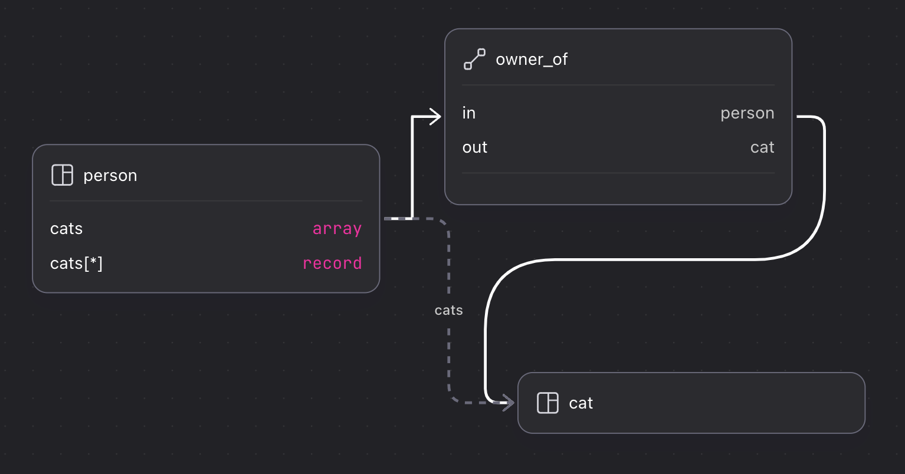

# Graph relations

The first item to take into account when using graph relations is whether they are the right solution in the first place, as graph edges are not the only way to link one record to another in SurrealDB.

## When to use graph relations

SurrealDB has two main ways to create relations between one record and another: record links, and graph relations.

A record link is a simple pointer from one record to another, a link that exists any time a record holds the record ID of another record. Record links are efficient because record IDs are direct pointers to the data of a record, and do not require a scan of the whole table.

Take the following example that creates one `user` who has written two `comment`s.

```surql
LET $new_user = CREATE ONLY user SET name = "User McUserson";
-- Create a new comment, use the output to update the user
UPDATE $new_user SET comments += (CREATE ONLY comment SET 
    text = "I learned something new!", 
    created_at = time::now())
    .id;
UPDATE $new_user SET comments += (CREATE ONLY comment SET
    text = "I don't get it, can you explain?",
    created_at = time::now())
    .id;
```

Querying a record link is easy as the link is unidirectional with nothing in between. In this case, the linked comments are simply a field on a `user` record and accessing them is as simple as any other field on a `user` record.

```surql
SELECT 
    name, 
    comments.{ created_at, text }
FROM user;
```

```surql title="Output"
[
	{
		comments: [
			{
				created_at: d'2024-12-12T02:39:07.644Z',
				text: 'I learned something new!'
			},
			{
				created_at: d'2024-12-12T02:39:07.645Z',
				text: "I don't get it, can you explain?"
			}
		],
		name: 'User McUserson'
	}
]
```

The unidirectionality of a record link is also a limitation, because the only way to query in the other direction is by using a subquery. With some knowledge of SurrealQL this is certainly doable, but a case like this is an indication that a graph link may be the better solution.

```surql
SELECT 
    *,
    -- Check the `user` table's `comments` field
    -- for the id of the current comment
    (SELECT id, name FROM user WHERE $parent.id IN comments) AS author
FROM comment;
```

```surql
[
	{
		author: [
			{
				id: user:f3t90z8uvns76sr3nxrd,
				name: 'User McUserson'
			}
		],
		created_at: d'2024-12-12T02:39:07.645Z',
		id: comment:gj1vtsd9d19z9afrc14j,
		text: "I don't get it, can you explain?"
	},
	{
		author: [
			{
				id: user:f3t90z8uvns76sr3nxrd,
				name: 'User McUserson'
			}
		],
		created_at: d'2024-12-12T02:39:07.644Z',
		id: comment:zhnbfopxspekknsi6vx6,
		text: 'I learned something new!'
	}
]
```

The other limitation is that there is no metadata about the context in which the comment was created. Take the following metadata for instance which contains information about a user's current location, operating system, and mood.

```surql
{
    location: "Arizona",
    os: "Windows 11",
    current_mood: "Happy"
}
```

This metadata isn't information about the user as a whole, nor the comment itself. It's information about the moment in time in which the `user` and `comment` were linked, and thus is best stored in a separate table. If this sort of metadata is necessary, then a graph table is the ideal solution.

## Creating a graph relation

The following example is similar to the one above, except that this time the `user` record does not have a `comments` field, leaving it seemingly separate from the `comment` created on the next line. However, this time a `RELATE` statement is used to create a graph edge called `wrote` joining the two of them, and this is the table that holds the metadata mentioned above.

```surql
LET $new_user = CREATE ONLY user SET name = "User McUserson";
LET $new_comment = CREATE ONLY comment SET 
    text = "I learned something new!", 
    created_at = time::now();

RELATE $new_user->wrote->$new_comment SET
	location = "Arizona",
	os = "Windows 11",
	mood = "happy";
```

Now that a graph edge has been established, the arrow operator can be used to traverse this path. The versatility of this operator is one of the key advantages of using graph edges, as they can be traversed forward, backward, recursively, and more.

```surql
-- Go through each user and find comment(s) it wrote
SELECT ->wrote->comment FROM user;
-- Go through each comment and find the user(s) that wrote it
SELECT <-wrote<-user FROM comment;
-- Go through each comment, find the user(s) that wrote it,
-- and then find all of their comments
SELECT <-wrote<-user->wrote->comment FROM comment;
```

## More on querying graph relations

As this page is devoted to an overview of when and how best to use graph relations, it does not go into the details of queries themselves. Many reference pages already exist in the SurrealDB documentation to learn this, including:

* The [`RELATE` statement](/docs/surrealql/statements/relate#querying-graphs)
* The [page on idioms](https://surrealdb.com/docs/surrealql/datamodel/idioms)
* The [SurrealDB Fundamentals course](https://surrealdb.com/learn/fundamentals)
* [Aeon's Surreal Renaissance](https://surrealdb.com/learn/book), chapters 5 to 8 in particular

## Tips and best practices with graph relations

### Defining tables as relations

Defining a table as `TYPE RELATION` ensures that it can only be created in the context of a relation between two records.

Adding `TYPE RELATION` to a `DEFINE TABLE` statement is enough to ensure this behaviour.

```surql
DEFINE TABLE likes TYPE RELATION;
```

Specifying the record types at the `in` and `out` fields of a graph table will ensure that no other records can be joined to each other in this way.

```surql
DEFINE TABLE likes TYPE RELATION IN person OUT blog_post | book;
```

One other advantage to strictly defining a relation table is that this information can be picked up by Surrealist to be displayed in its Designer view.

Take the following queries that create some records and relate them to each other.

```surql
CREATE person:one, book:one, blog_post:one;
RELATE person:one->likes->book:one;
RELATE person:one->likes->blog_post:one;
```

As the `likes` table is not defined as a relation, Surrealist is unable to determine anything about the table besides the fact that it exists, leading to the following view.


Defining the table as a `TYPE RELATION` will improve the layout somewhat by making it clear that `likes` is a graph table.

```surql
DEFINE TABLE likes TYPE RELATION;
CREATE person:one, book:one, blog_post:one;
RELATE person:one->likes->book:one;
RELATE person:one->likes->blog_post:one;
```


If the `in` and `out` fields are specified, however, Surrealist will now be able to graphically display the relation between all these records through the `likes` table.

```surql
DEFINE TABLE likes 
	TYPE RELATION
	IN person 
	OUT blog_post | book;
CREATE person:one, book:one, blog_post:one;
RELATE person:one->likes->book:one;
RELATE person:one->likes->blog_post:one;
```


### Create a unique index if the graph relationship is between equals

While most examples involve a clear subject and object relationship, sometimes a graph edge represents a relationship such as friendship, a partnership, sister cities, etc. in which this is not clear.

```surql
CREATE person:one, person:two;

-- Relate them like this?
RELATE person:one->friends_with->person:two;
-- Or like this?
RELATE person:two->friends_with->person:one;
```

To ensure that this relationship cannot be established more than once, define a field made of the sorted `in` and `out` fields of the graph table, and define an index on it with a unique constraint.

```surql
DEFINE FIELD key ON TABLE friends_with VALUE array::sort([in, out]);
DEFINE INDEX only_one_friendship ON TABLE friends_with FIELDS key UNIQUE;
```

With this constraint in place, no second `friends_with` can be initiated from the other side.

```surql
CREATE person:one, person:two;
RELATE person:one->friends_with->person:two;
RELATE person:two->friends_with->person:one;
```

```surql title="Output"
'Database index `only_one_friendship` already contains person:one, with record `friends_with:hdt5hoamvs8l65cw7a3t`'
```

The `<->` operator can be used in this case to traverse both the `in` and `out` fields of the `friends_with` table, along with the [`array::complement()`](https://surrealdb.com/docs/surrealql/functions/database/array#arraycomplement) function to exclude the record in question from showing up as its own friend.

```surql
SELECT *, array::complement(<->friends_with<->person, [id]) AS friends FROM person;
```

For further details on this pattern, see [this section](https://surrealdb.com/docs/surrealql/statements/relate#bidirectional-relation-querying) in the page on the `RELATE` statement.


### Traverse directly from a record instead of using SELECT


### Graph paths in schemas

While most examples in the documentation show how to traverse graph paths inside a `SELECT` statement, they can just as easily be defined as a field on a table.

```surql
DEFINE FIELD is_employed ON TABLE person VALUE !!(SELECT VALUE <-employs<-company FROM ONLY $this);

CREATE person:1, person:2, company:1;
RELATE company:1->employs->person:1;
person:1.*;
```

However, note that the output of the query above shows `false` for the `is_employed` field, as it was calculated at the point that `person:1` was created. The `VALUE` clause will only recalculate if a record is updated.

```surql
UPDATE person:1;
```

```surql title="Output"
[
	{
		id: person:1,
		is_employed: true
	}
]
```

A `future` makes more sense in this case, as a future is calculated each time a record is queried, not just whenever it is created or updated.

```surql
DEFINE FIELD is_employed ON TABLE person VALUE <future> { RETURN !!(SELECT VALUE <-employs<-company FROM ONLY $this) };

CREATE person:1, person:2, company:1;
RELATE company:1->employs->person:1;

person:1.*;
```

```surql title="Output"
{
	id: person:1,
	is_employed: true
}
```

### RELATE can be used before records to relate exist

One record can be related to another before the two records exist.

```surql
-- Works fine
RELATE person:one->likes->person:two;
-- Returns []
person:one->likes->person;
CREATE person:one, person:two;
-- Now it returns [ person:two ]
person:one->likes->person;
```

If this is not desirable, the `ENFORCED` keyword can be added to a `DEFINE TABLE` statement.

```surql
DEFINE TABLE likes TYPE RELATION IN person OUT person ENFORCED;
```

```surql title="Output"
"The record 'person:one' does not exist"
```

However, certain patterns might make it desirable to use `RELATE` before creating a record. If a record has a field with a `VALUE` clause that depends on a graph edge, it will only be calculated when the record is created or updated. In this case, a final `CREATE` for the records involved will allow the value to be calculated once, instead of needing to manually `UPDATE` the records once more after they are created.

```surql
-- A star has planets
DEFINE FIELD planets ON TABLE star VALUE $this<-orbits<-planet;
-- A planet orbits a start and has moons
DEFINE FIELD orbits ON TABLE planet VALUE $this.id->orbits->star;
DEFINE FIELD moons ON TABLE planet VALUE $this.id<-orbits<-moon;
-- A moon orbits a planet
DEFINE FIELD orbits ON TABLE moon VALUE $this.id->orbits->planet;

RELATE [planet:mercury, planet:venus, planet:earth, planet:mars]->orbits->star:the_sun;
RELATE moon:the_moon->orbits->planet:earth;
RELATE [moon:phobos, moon:deimos]->orbits->planet:mars;

CREATE star:the_sun, planet:mercury, planet:venus, planet:earth, planet:mars, moon:phobos, moon:deimos;

SELECT * FROM planet;
```

Alternatively, a situation might simply involve a relation that exists when a record does not. For example, a street in a city might have a set of addresses registered with a predictable record ID (such as an ID composed of a street number and name) but no houses at the location yet.

```surql
CREATE street:frankfurt_road;
RELATE street:frankfurt_road->contains->[
    house:[200, "Frankfurt Road"], 
    house:[205, "Frankfurt Road"],
    house:[210, "Frankfurt Road"],
];

-- Twelve months later...
CREATE house:[200, "Frankfurt Road"] SET sq_m = 110.5;
```

### Using recursive queries

[Recursive queries](/docs/surrealql/datamodel/idioms#recursive-paths) allow traversal of a path down to a specific depth.

Take the following `person` records that are connected to each other via the `child_of` path.

```surql
CREATE |person:1..15|;
-- parents of person:1
RELATE person:1->child_of->[person:2, person:3];
-- grandparents of person:1
RELATE person:2->child_of->[person:4, person:5];
RELATE person:3->child_of->[person:6, person:7];
-- great-grandparents of person:1
RELATE person:4->child_of->[person:8, person:9];
RELATE person:5->child_of->[person:10, person:11];
RELATE person:6->child_of->[person:12, person:13];
RELATE person:7->child_of->[person:14, person:15];
```

Following the `person:1` record down three depths (parents, grandparents, great-grandparents) can be done manually by repeating the `->child_of->person` path as many times as required.

```surql
SELECT 
    ->child_of->person AS parents,
    ->child_of->person->child_of->person AS grandparents,
    ->child_of->person->child_of->person->child_of->person AS great_grandparents
FROM ONLY person:1;
```

The recursive syntax can be used in this case to repeat a path as many times as desired instead of manually typing.

```surql
SELECT 
    @.{1}->child_of->person AS parents,
    @.{2}->child_of->person AS grandparents,
    @.{3}->child_of->person AS grandparents
FROM ONLY person:1;
```

However, the recursive syntax goes beyond simply saving keystrokes on a regular graph query. It can also be used to return a single nested object that recurses a number of times as instructed down an indicated path.

```surql
-- Range to start at a depth of one, try to go down to depth of three
SELECT @.{3}.{
    id,
	-- At each depth, use this path to reach the next one
    parents: ->child_of->person.@
} FROM person:1;
```

```surql
person:1.{3}.{
    id,
    parents: ->child_of->person.@
};
```

While developed for graph relations in particular, this path can be used in any context.

For more details on SurrealDB's recursive syntax, see the following pages:

* [Idioms: recursive paths](/docs/surrealql/datamodel/idioms#recursive-paths)

### Don't use them if you can use a record link instead

To sum up the post with the point made at the beginning, graph edges are just one of two ways to join records and are not always the ideal solution. If graph edges are not strictly necessary and performance is key, then record links are the way to go.

The following example that links one `person` to 10000 `cat` records in both ways shows at the end how much more performant record links are.

```surql
LET $cats = CREATE |cat:1..10000|;
CREATE person:1 SET cats = $cats;
FOR $cat IN $cats {
  RELATE person:1->owner_of->$cat;  
};

-- Record links, very performant
LET $_ = SELECT cats FROM person:1;
-- Graph traversal, more complex query
LET $_ = person:1->owner_of->cat;
```

This can be seen visually by adding the `owner_of` table and `cats` field to the schema inside Surrealist. As the Designer view shows, the `cats` field is simply a direct link to a `cat` record, while to reach `cat` via graph traversal will always involve the `owner_of` table located in between the two.

```surql
DEFINE TABLE OVERWRITE owner_of TYPE RELATION IN person OUT cat;
DEFINE FIELD cats ON TABLE person TYPE array<record<cat>>;
```



