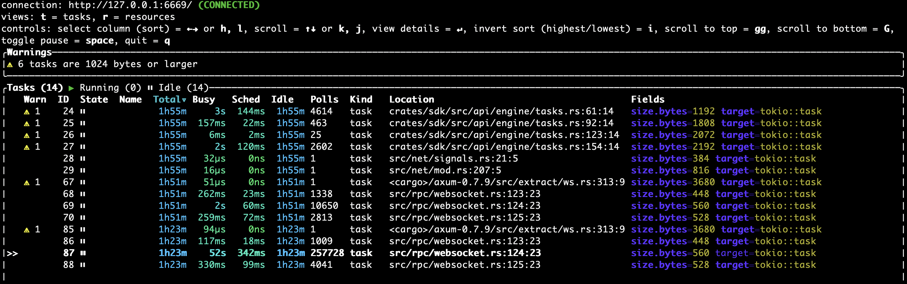
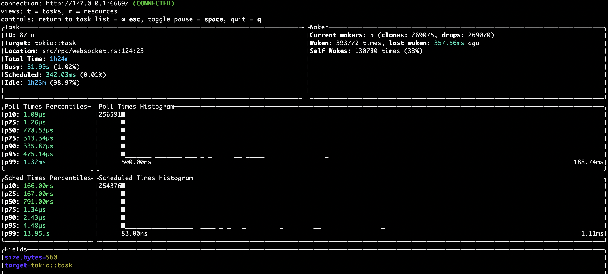

import Since from "@components/shared/Since.astro";

# Observability

SurrealDB can be monitored by enabling the built in observability.

## Enable observability
To enable observability, the `SURREAL_TELEMETRY_PROVIDER` environment variable has to be set to `otlp`. If set to anything else, no observability will be available.

If enabled, SurrealDB will send metrics and/or traces to an [OpenTelemetry Collector](https://opentelemetry.io/docs/collector/).  Configuration of the collector is done via [environment variables](https://opentelemetry.io/docs/languages/sdk-configuration/otlp-exporter/). The most important one is [OTEL_EXPORTER_OTLP_ENDPOINT](https://opentelemetry.io/docs/languages/sdk-configuration/otlp-exporter/#otel_exporter_otlp_endpoint). By default this is set to localhost. It should be set to the GRPC endpoint of your OTEL collector. For example if your OTEL collector named `my-collector` is running in Kubernetes in the `monitoring` namespace the following can be used: 

```
OTEL_EXPORTER_OTLP_ENDPOINT="http://my-collector.monitoring.svc.cluster.local:4317"
```

Metrics can be disabled (even if `SURREAL_TELEMETRY_PROVIDER` is set to `otlp`) by setting the `SURREAL_TELEMETRY_DISABLE_METRICS` environment variable to `true`. Similarly traces can be disabled by setting `SURREAL_TELEMETRY_DISABLE_TRACING` to `true`.

## Metrics

Metrics are gathered every minute and sent to the collector. The following metrics are present:

<table>
    <thead>
        <tr>
            <th colspan="1" scope="col">Name</th>
            <th colspan="1" scope="col">[Instrument](https://opentelemetry.io/docs/concepts/signals/metrics/#metric-instruments)</th>
            <th colspan="1" scope="col">Explanation</th>
        </tr>
    </thead>
    <tbody>
        <tr>
            <td colspan="1" scope="row" data-label="Metric name">
                rpc.server.duration
            </td>
            <td colspan="1" scope="row" data-label="Type">
                histogram
            </td>
            <td colspan="1" scope="row" data-label="Explanation">
                Measures duration of inbound RPC requests in milliseconds
            </td>
        </tr>
        <tr>
            <td colspan="1" scope="row" data-label="Metric name">
                rpc.server.active_connections
            </td>
            <td colspan="1" scope="row" data-label="Type">
                counter
            </td>
            <td colspan="1" scope="row" data-label="Explanation">
                The number of active WebSocket connections
            </td>
        </tr>
        <tr>
            <td colspan="1" scope="row" data-label="Metric name">
                rpc.server.response.size
            </td>
            <td colspan="1" scope="row" data-label="Type">
                histogram
            </td>
            <td colspan="1" scope="row" data-label="Explanation">
                Measures the size of HTTP response messages
            </td>
        </tr>
        <tr>
            <td colspan="1" scope="row" data-label="Metric name">
                http.server.duration
            </td>
            <td colspan="1" scope="row" data-label="Type">
                histogram
            </td>
            <td colspan="1" scope="row" data-label="Explanation">
                The HTTP server duration in milliseconds
            </td>
        </tr>
        <tr>
            <td colspan="1" scope="row" data-label="Metric name">
                http.server.active_requests
            </td>
            <td colspan="1" scope="row" data-label="Type">
                counter
            </td>
            <td colspan="1" scope="row" data-label="Explanation">
                The number of active HTTP requests
            </td>
        </tr>
        <tr>
            <td colspan="1" scope="row" data-label="Metric name">
                http.server.request.size
            </td>
            <td colspan="1" scope="row" data-label="Type">
                histogram
            </td>
            <td colspan="1" scope="row" data-label="Explanation">
                Measures the size of HTTP request messages
            </td>
        </tr>
        <tr>
            <td colspan="1" scope="row" data-label="Metric name">
                http.server.response.size
            </td>
            <td colspan="1" scope="row" data-label="Type">
                histogram
            </td>
            <td colspan="1" scope="row" data-label="Explanation">
                Measures the size of HTTP response messages
            </td>
        </tr>
    </tbody>
</table>

The metrics are shown here in the form required by the [OpenTelemetry Metrics Semantic Conventions](https://opentelemetry.io/docs/specs/semconv/general/metrics/) with a `.` separator. When ingested into Prometheus the `.` separator will be [replaced](https://prometheus.io/blog/2024/03/14/commitment-to-opentelemetry/#support-utf-8-metric-and-label-names) with an `_`. For example `rpc.server.active.connections` will be transformed into `rpc_server_active_connections`.

## Tokio console

<Since v="v3.0.0-beta" />

The [tokio console](https://github.com/tokio-rs/console) tool can also be used to observe the low-level async tasks for the database.

To use it, [install the Cargo package manager for Rust](https://doc.rust-lang.org/cargo/getting-started/installation.html), use the command `cargo install --locked tokio-console` to install tokio console, and then `tokio-console` to run it.





The following environment variables are used to manage the console:

* `SURREAL_TOKIO_CONSOLE_ENABLED` set to `true` to enable the console
* `SURREAL_TOKIO_CONSOLE_SOCKET_ADDR` to override the default address at `127.0.0.1:6669`
* `SURREAL_TOKIO_CONSOLE_RETENTION` to override the default `6s` (six seconds) value for length of time to [retain data for completed events](https://docs.rs/console-subscriber/0.4.1/console_subscriber/struct.Builder.html#method.retention).

## Log output settings

SurrealDB contains a large number of flags for the [surreal start](/docs/surrealdb/cli/start) command and [environment variables](/docs/surrealdb/cli/env) to modify the output from the database server. A quick overview of some of these flags is as follows:

* Use `--log` to set the logging level (`info`, `warn`, `trace`, etc.).
* Use `--log-format` to set the format (`text` or `json`).
* Use `--log-socket` to send logs to a certain host:port.
* Use `--log-file-enabled` to output logs to a file, followed by `--log-file-path` to specify the path to save logs to to.
* Use `--log-file-rotation` to specify whether to create a new file for logs at a certain interval (`daily`, `hourly`, or `never`).
* Use `--slow-log-threshold` to specify a duration after which a query will be logged as a slow query.
* Use `--slow-log-param-allow` and `--slow-log-param-deny` to indicate which parameters are to be calculated before logging. For example, if `$table_name` has the value "person", allowing `table_name` will change `SELECT * FROM $table_name` to `SELECT * FROM person` in the logs.

