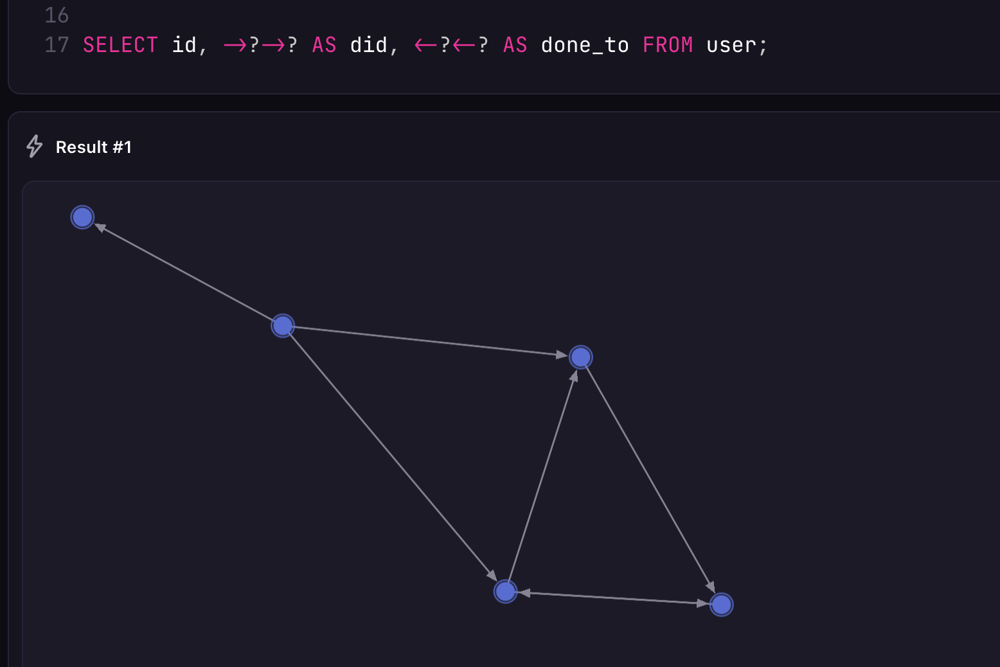

# Record IDs

> [!NOTE]
> As of `v2.0.0`, SurrealDB no longer eagerly converts a string into a record. An [implicit `r` prefix or cast](/docs/surrealql/datamodel/casting#casting-vs-affixes) is required instead.

SurrealDB record IDs are composed of a table name and a record identifier separated by a `:` in between, allowing for a simple and consistent way to reference records across the database. Record IDs are used to uniquely identify records within a table, to [query](/docs/surrealql/statements/select), [update](/docs/surrealql/statements/update), and [delete](/docs/surrealql/statements/delete) records, and serve as [links](/docs/surrealql/datamodel/records) from one record to another.

Record IDs can be constructed from a number of ways, including [alphanumeric text](/docs/surrealql/datamodel/ids#text-record-ids), complex Unicode text and symbols, [numbers](/docs/surrealql/datamodel/ids#numeric-record-ids), arrays, objects, [built-in ID generation functions](/docs/surrealql/datamodel/ids#random-ids), and [a function to generate an ID from values](/docs/surrealql/functions/database/type#typerecord).


All of the following are examples of valid record IDs in SurrealQL.

```surql
company:surrealdb
company:w6xb3izpgvz4n0gow6q7
reaction:`🤪`
weather:['London', d'2025-02-14T01:52:50.375Z']
```

As all record IDs are unique, trying to create a new record with an existing record ID will return an error. To create a record or modify it if the ID already exists, use an [`UPSERT`](/docs/surrealql/statements/upsert) statement or an [`INSERT`](/docs/surrealql/statements/insert#example-usage) statement with an `ON DUPLICATE KEY UPDATE` clause.

## Types of Record IDs

### Random IDs

When you [create a record](/docs/surrealql/statements/create) without specifying the full ID, a random identifier is assigned after the table name. This differs from the traditional default of auto-increment or serial IDs that many developers are used to.

```surql
/**[test]

[[test.results]]
value = "[{ id: company:igtjgekhxfbd9km14j7t }]"
skip-record-id-key = true

*/


CREATE company;
```

```surql title="Output"
[
	{
		id: company:ezs644u19mae2p68404j
	}
]
```

Record IDs can be generated with a number of built-in ID generation functions, which are cryptographically secure and suitable for dispersion across a distributed datastore. These include a 20 digit alphanumeric ID (the default), sequentially incrementing and temporally sortable ULID Record identifiers, and UUID version 7 Record identifiers.

```surql
/**[test]

[[test.results]]
value = "[{ celsius: 37.5f, id: temperature:f8xh13smeqhbg7h9o1rw, time: d'2025-10-03T01:03:27.756064Z' }]"
skip-record-id-key = true

[[test.results]]
value = "[{ celsius: 37.5f, id: temperature:a5wxgrluu3n0qxrgkfb9, time: d'2025-10-03T01:03:27.756317Z' }]"
skip-record-id-key = true

[[test.results]]
value = "[{ celsius: 37.5f, id: temperature:01K6KSGTGCZ631S0325WPW3KF1, time: d'2025-10-03T01:03:27.756405Z' }]"
skip-record-id-key = true

[[test.results]]
value = "[{ celsius: 37.5f, id: temperature:u'0199a798-6a0c-7f51-8b87-e856013f98ec', time: d'2025-10-03T01:03:27.756501Z' }]"
skip-record-id-key = true

*/


// Generate a random record ID 20 characters in length
// Charset: `abcdefghijklmnopqrstuvwxyz0123456789`
CREATE temperature:rand() SET time = time::now(), celsius = 37.5;
// Identical to the above CREATE statement, because
// :rand() is the default random ID format
CREATE temperature SET time = time::now(), celsius = 37.5;

// Generate a ULID-based record ID
CREATE temperature:ulid() SET time = time::now(), celsius = 37.5;
// Generate a UUIDv7-based record ID
CREATE temperature:uuid() SET time = time::now(), celsius = 37.5;
```

### Text Record IDs

Text record IDs can contain letters, numbers and `_` characters.

```surql
/**[test]

[[test.results]]
value = "[{ id: company:surrealdb, name: 'SurrealDB' }]"

[[test.results]]
value = "[{ id: user_version_2025:aajz3qh1nk0b27tztsa7, name: 'Alucard' }]"
skip-record-id-key = true

*/

CREATE company:surrealdb SET name = 'SurrealDB';
CREATE user_version_2025 SET name = 'Alucard';
```

To create a record ID with complex characters, use <code>`</code> (backticks) around the table name and/or record identifier.

```surql
/**[test]

[[test.results]]
value = "[{ author: person:tobie, id: article:⟨8424486b-85b3-4448-ac8d-5d51083391c7⟩, time: d'2025-10-03T01:06:17.050210Z' }]"

[[test.results]]
value = "[{ author: person:⟨Lech_Wałęsa⟩, id: ⟨Artykuł⟩:100 }]"

*/

CREATE article:`8424486b-85b3-4448-ac8d-5d51083391c7` SET
    time = time::now(),
    author = person:tobie;

CREATE `Artykuł`:100 SET
    author = person:`Lech_Wałęsa`;
```

The parts of record IDs with complex characters will display enclosed by <code>`</code> backticks.

```surql title="Output"
-------- Query --------

[
	{
		author: person:tobie,
		id: article:`8424486b-85b3-4448-ac8d-5d51083391c7`,
		time: d'2025-02-18T01:48:46.364Z'
	}
]

-------- Query --------

[
	{
		author: person:`Lech_Wałęsa`,
		id: `Artykuł`:100
	}
]
```

### Numeric Record IDs

If you create a record ID with a number as a string, it will be stored with <code>`</code> backticks to differentiate it from a number.

```surql
/**[test]

[[test.results]]
value = "[{ id: article:10 }]"

[[test.results]]
value = "[{ id: article:⟨10⟩ }]"

[[test.results]]
value = "[{ id: article:article10 }]"

[[test.results]]
value = "[article:10, article:⟨10⟩, article:article10]"

*/

CREATE article SET id = 10;
CREATE article SET id = "10";
CREATE article SET id = "article10";
SELECT VALUE id FROM article;
```

As the record ID `article:10` is different from ```article:`10` ```, no errors are returned when creating and both records turn up in the output of the `SELECT` statement. Meanwhile, the article with the identifier `article10` does not use backticks as there is no `article10` number to differentiate it from.

```surql title="Output"
[
	article:10,
	article:`10`,
    article:article10
]
```

If a numeric value is specified without any decimal point suffix and is within the range `-9223372036854775808` to `9223372036854775807` then the value will be parsed, stored, and treated as a 64-bit signed integer.

Any numeric numbers outside of the range of a signed 64-bit integer will be stored as a string.

```surql
/**[test]

[[test.results]]
value = "[{ celsius: 37.5f, id: temperature:17493, time: d'2025-10-03T01:09:50.155406Z' }]"

[[test.results]]
value = "[{ events: ['Galactic senate convenes', 'Mr. Bean still waits in a field'], id: year:⟨29878977097987987979232⟩ }]"

*/

CREATE temperature:17493 SET time = time::now(), celsius = 37.5;
CREATE year:29878977097987987979232 SET
    events = [
        "Galactic senate convenes",
        "Mr. Bean still waits in a field"
    ];
```

```surql title="Output"
-------- Query --------

[
	{
		celsius: 37.5f,
		id: temperature:17493,
		time: d'2025-02-17T06:21:08.911Z'
	}
]

-------- Query s--------

[
	{
		events: [
			'Galactic senate convenes',
			'Mr. Bean still waits in a field'
		],
		id: year:`29878977097987987979232`
	}
]
```

### Array-based Record IDs

Record IDs can be constructed out of arrays and even objects. This sort of record ID is most used when you have a field or two that will be used to look up records inside a [record range](/docs/surrealql/datamodel/ids#record-ranges), which is extremely performant. This is in contrast to using a `WHERE` clause to filter, which involves a table scan.

Records in SurrealDB can store arrays of values, with no limit to the depth of the arrays. Arrays can store any value stored within them, and can store different value types within the same array.

```surql
/**[test]

[[test.results]]
value = "[{ conditions: 'cloudy', id: weather:['London', d'2025-02-13T05:00:00Z'], temperature: 5.7f }]"

*/

CREATE weather:['London', d'2025-02-13T05:00:00Z'] SET
    temperature = 5.7,
    conditions = "cloudy";
```

```surql title="Output"
[
	{
		conditions: 'cloudy',
		id: weather:[
			'London',
			d'2025-02-13T05:00:00Z'
		],
		temperature: 5.7f
	}
]
```

### Why record ranges are performant

The main reason why record ranges are so performant is simply because the database knows ahead of time in which area to look for records in a query, and therefore has a smaller "surface area" to work in.

This can be demonstrated by seeing what happens when a single record range query encompasses all of the records in a database. The example below creates 10,000 `player` records that have an array-based record ID that begins with `'mage'`, allowing them to be used in a record range query, as well as a field called `class` that is also `'mage'`, which will be used in a `WHERE` clause to compare performance.

Interestingly, in this case a record range query is only somewhat more performant. This is because both queries end up iterating over 10,000 records, with the only difference being that the query with a `WHERE` clause also checks to see if the value of the `class` field is equal to `'mage'`.

```surql
FOR $_ IN 0..10000 {
    CREATE player:['mage', rand::id()] SET class = 'mage';
};

LET $_ = SELECT * FROM player:['mage', NONE]..['mage', ..];
LET $_ = SELECT * FROM player WHERE class = 'mage';
```

If the number of `player` records is extended to a larger number of classes, however, the difference in performance will be much larger. In this case the record range query is still only iterating a relatively small surface area of 10,000 records, while the second one has ten times this number to go through in addition to the `WHERE` clause on top.

```surql
FOR $_ IN 0..10000 {
  CREATE player:['mage', rand::id()] SET class = 'mage';
  CREATE player:['barbarian', rand::id()] SET class = 'barbarian';
  CREATE player:['rogue', rand::id()]     SET class = 'rogue';
  CREATE player:['bard', rand::id()]      SET class = 'bard';
  CREATE player:['sage', rand::id()]      SET class = 'sage';
  CREATE player:['psionic', rand::id()]   SET class = 'psionic';
  CREATE player:['thief', rand::id()]     SET class = 'thief';
  CREATE player:['paladin', rand::id()]   SET class = 'paladin';
  CREATE player:['ranger', rand::id()]    SET class = 'ranger';
  CREATE player:['cleric', rand::id()]    SET class = 'cleric';
};

LET $_ = SELECT * FROM player:['mage', NONE]..['mage', ..];
LET $_ = SELECT * FROM player WHERE class = 'mage';
```

### IDs made with parameters and function calls

Parameters and function calls can be used inside array- and object-based record IDs in the same way as on standalone arrays and objects.

```surql
/**[test]

[[test.results]]
value = "NONE"

[[test.results]]
value = "[{ conditions: 'cloudy', id: weather:['Seoul', d'2025-10-03T01:11:38.204589Z'], temperature: -2.3f }]"
skip-datetime = true

[[test.results]]
value = "[{ conditions: 'cloudy', id: weather:['London', d'2025-10-03T01:11:38.204961Z'], temperature: 5.3f }]"
skip-datetime = true

*/

LET $now = time::now();

CREATE weather:['Seoul', $now] SET
    temperature = -2.3,
    conditions = "cloudy";

CREATE weather:['London', time::now()] SET
    temperature = 5.3,
    conditions = "cloudy";
```

To create a record that uses a parameter or function call as its entire record identifier, the [`type::record()`](/docs/surrealql/functions/database/type#typerecord) function can be used. (Note: this function was known as `type::thing()` before SurrealDB 3.0)

```surql
/**[test]

[[test.results]]
value = "NONE"

[[test.results]]
value = "[{ city: 'London', id: weather:⟨2025-10-03T01:13:14.238633Z⟩ }]"
skip-record-id-key = true

*/

LET $now = time::now();

CREATE type::record("weather", $now) SET city = 'London';
```

```surql title="Output"
[
	{
		city: 'London',
		id: weather:`2025-02-18T02:30:08.563Z`
	}
]
```

## Defining record IDs in a schema

The type name of a record ID is `record`, which by default allows any sort of record. This type can be set inside a [`DEFINE FIELD`](/docs/surrealql/statements/define/field) statement.

```surql
/**[test]

[[test.results]]
value = "NONE"

[[test.results]]
value = "NONE"

[[test.results]]
value = "[{ friends: [person:one, person:two], id: person:663uogu8gnw31irybeer, possessions: [book:one, house:one] }]"
skip-record-id-key = true

*/

DEFINE FIELD possessions ON TABLE person TYPE option<array<record>>;
DEFINE FIELD friends ON TABLE person TYPE option<array<record<person>>>;

CREATE person SET
    possessions = [ book:one, house:one],
    friends = [ person:one, person:two ];
```

Be sure to use just `record` instead of `record<any>`, as `<any>` here would imply actual records of a table called `any`.

```surql
/**[test]

[[test.results]]
value = "NONE"

[[test.results]]
match = "$error = "Couldn't coerce value for field `possessions` of `person:*`: Expected `none | array<record<any>>` but found `[book:one, house:one]`""
error = true

[[test.results]]
value = "[{ id: person:u6qd2t4ij2h45bkf2gk4, possessions: [any:one, any:two] }]"
skip-record-id-key = true

*/

DEFINE FIELD possessions ON TABLE person TYPE option<array<record<any>>>;

-- Won't work, 'book' and 'house' are not of table 'any'
CREATE person SET
    possessions = [ book:one, house:one ];

-- Actually expects this, which is probably
-- not what the DEFINE FIELD intended
CREATE person SET
    possessions = [ any:one, any:two ];
```

## Record ranges

SurrealDB supports the ability to query a range of records, using the record ID. Record ID range queries retrieve records using the natural sorting order of the record IDs, making a table scan unnecessary. These range queries can be used to query a range of records in a timeseries context.

```surql
-- Select all person records with IDs between the given range
SELECT * FROM person:1..1000;

-- Select all records for a particular location, inclusive
SELECT * FROM temperature:['London', NONE]..=['London', ..];

-- Select all temperature records with IDs less than a maximum value
SELECT * FROM temperature:..['London', '2022-08-29T08:09:31'];

-- Select all temperature records with IDs greater than a minimum value
SELECT * FROM temperature:['London', '2022-08-29T08:03:39']..;

-- Select all temperature records with IDs between the specified range
SELECT * FROM temperature:['London', '2022-08-29T08:03:39']..['London', '2022-08-29T08:09:31'];
```

The following example shows the difference in performance between a regular query that uses a `WHERE` clause and a record range scan.

```surql
FOR $num IN 0..=100000 {
  CREATE person SET id = $num, num = $num  
};

-- Assign the output to an unused parameter
-- to avoid excessive output
LET $_ = SELECT * FROM person WHERE num IN 0..=1000;
LET $_ = SELECT * FROM person:0..=1000;
```

## Tips and best practices for record IDs

### Why choose the right record ID format

Choosing an apt record ID format is especially important because record IDs is SurrealQL are immutable. Take the following `user` records for example:

```surql
FOR $i IN 0..5 {
    CREATE user SET user_num = $i, name = "User number " + <string>user_num;
};
```

Each of these `user` records will have a random ID, such as `user:wvjqjc5ebqvfg3aw7g61`. If a decision is made to move away from random IDs to some other form, such as an incrementing number, this will have to be done manually.

```surql
FOR $user IN SELECT * FROM user {
    -- Use type::record to make a record ID
    -- from the user_num field
    CREATE type::record("user", $user.user_num);
    -- Then delete the old user
    DELETE $user;
};

SELECT * FROM user;
```

The final query returning just the IDs shows that they have been recreated with new IDs.

```surql title="Output"
[
	{
		id: user:0,
		name: 'User number 0'
	},
	{
		id: user:1,
		name: 'User number 1'
	},
	{
		id: user:2,
		name: 'User number 2'
	},
	{
		id: user:3,
		name: 'User number 3'
	},
	{
		id: user:4,
		name: 'User number 4'
	}
]
```

However, record IDs are also used as [record links](/docs/surrealql/datamodel/records) and to create [graph relations](/docs/surrealql/statements/relate). If this is the case, more work will have to be done in order to recreate the former state.

The following example shows five `user` records, which each have a 50% chance of liking each of the other users.

```surql
FOR $i IN 0..5 {
    CREATE user SET user_num = $i, name = "User number " + <string>user_num;
};

LET $users = SELECT * FROM user;
FOR $user IN $users {
    LET $others = array::complement($users, [$user.id]);
    FOR $counterpart IN $others {
        IF rand::bool() {
            RELATE $user->likes->$counterpart;
        }
    }
};
```

Finding out the current relational state can be done with a query like the following which shows all of the graph tables in which a record is located at the `in` or `out` point. The `?` is a wildcard operator, returning any and all tables found at this point of the graph query.

```surql
SELECT
    id,
    ->?->? AS did, 
    <-?<-? AS done_to
FROM user;
```

```surql title="Output"
[
	{
		did: [
			user:zwfnk4by9gmopf6eeqm0
		],
		done_to: [
			user:d6bx6sch5li8qmhq3ljl,
			user:ekovipptanvmgr8f48v6
		],
		id: user:6ycb63zr0k3cpzwel1ga
	},
	{
		did: [
			user:ekovipptanvmgr8f48v6,
			user:6ycb63zr0k3cpzwel1ga,
			user:zk7tpaduzaiuswll58sg
		],
		done_to: [],
		id: user:d6bx6sch5li8qmhq3ljl
	}
    -- and so on..
]
```

Surrealist's [graph visualization view](/blog/whats-new-in-surrealist-3-2#graph-visualisation) can help as well.



With this in mind, here are some of the items to keep in mind when deciding what sort of record ID format to use.

### Meaningful sortable IDs are faster to query

Records are returned in ascending record ID order by default. As the following query shows, a `SELECT` statement on a large number of `user` records with random IDs will show those with record identifiers starting with a large number of zeroes. While the IDs are sortable, the IDs themselves are completely random.

```surql
CREATE |user:200000| RETURN NONE;
SELECT VALUE id FROM user LIMIT 4;
```

```surql title="Output"
[
	user:0001th0nnywnczi7mrvk,
	user:000t5r3y7u8stqtecvht,
	user:000tjk1nbi1it1bedplc,
	user:001dfral92ltbdznypcd
]
```

For a large number of records, pagination can be used to retrieve a certain amount of records at a time.

```surql
-- Returns the same four records as above
SELECT VALUE id FROM user START 0 LIMIT 2;
SELECT VALUE id FROM user START 2 LIMIT 2;
```

```surql title="Output"
-------- Query --------

[
	user:0001th0nnywnczi7mrvk,
	user:000t5r3y7u8stqtecvht
]

-------- Query --------

[
	user:001dfral92ltbdznypcd,
	user:001hv9g1uzh32nophrpo
]
```

As record ranges are very performant, consider moving any fields that may be used in a `WHERE` clause into the ID itself.

In the following example, a number of `user` records are created using the default random ID, plus a `num` field that tracks in which order the user was created.

```surql
FOR $num IN 0..100 {
    CREATE user SET num = $num;
    sleep(1ms); -- Simulate a bit of time between user creation
};

SELECT * FROM user WHERE num IN 50..=51;
SELECT * FROM user START 50 LIMIT 2;
```

As the output from the `SELECT` statements show, a `WHERE` clause is needed to find two users starting at a `num` of 50, as `START 50` starts based on the user of the record ID, which is entirely random.

```surql
-------- Query --------

[
	{
		id: user:pqpeg0edt8kpda907o01,
		num: 50
	},
	{
		id: user:ty6qr7zyob5dh882it08,
		num: 51
	}
]

-------- Query --------

[
	{
		id: user:hvfp5m5ty7n2k95dbamv,
		num: 70
	},
	{
		id: user:hvfumcmmveuolg4e2h26,
		num: 36
	}
]
```

Using a ULID in this case will allow the IDs to remain random, but still sorted by date of creation.

```surql
/**[test]

[[test.results]]
value = "NONE"

[[test.results]]
value = "[{ id: user:01K6KTHCCJW7ZA6NWBZEFEVDC9, num: 50 }, { id: user:01K6KTHCCNRMN565T2H6JW70D6, num: 51 }]"
skip-record-id-key = true

[[test.results]]
value = "[{ id: user:01K6KTHCCJW7ZA6NWBZEFEVDC9, num: 50 }, { id: user:01K6KTHCCNRMN565T2H6JW70D6, num: 51 }]"
skip-record-id-key = true

*/

FOR $num IN 0..100 {
    CREATE user:ulid() SET num = $num;
    sleep(1ms);
};

SELECT * FROM user WHERE num IN 50..=51;
SELECT * FROM user START 50 LIMIT 2;
```

Not only is the `START 50 LIMIT 2` query more performant, but the entire `num` field could be removed if its only use is to return records by order of creation.

```surql title="Same record IDs for both queries this time"
-------- Query --------

[
	{
		id: user:01JM1AHN7DDN7XM5KZ2RR2YM1S,
		num: 50
	},
	{
		id: user:01JM1AHN7FS4A3B6RNFCF64H90,
		num: 51
	}
]

-------- Query --------

[
	{
		id: user:01JM1AHN7DDN7XM5KZ2RR2YM1S,
		num: 50
	},
	{
		id: user:01JM1AHN7FS4A3B6RNFCF64H90,
		num: 51
	}
]
```

### Move exact matches in array-based record IDs to the front

Take the following `event` records which can be queried as a perfomant record range.

```surql
/**[test]

[[test.results]]
value = "[{ id: event:[d'2025-05-05T08:00:00Z', user:one, 'debug'], info: 'Logged in' }]"

[[test.results]]
value = "[{ id: event:[d'2025-05-05T08:10:00Z', user:one, 'debug'], info: 'Logged out' }]"

[[test.results]]
value = "[{ id: event:[d'2025-05-05T08:01:00Z', user:two, 'debug'], info: 'Logged in' }]"

*/

CREATE event:[d'2025-05-05T08:00:00Z', user:one, "debug"] SET info = "Logged in";
CREATE event:[d'2025-05-05T08:10:00Z', user:one, "debug"] SET info = "Logged out";
CREATE event:[d'2025-05-05T08:01:00Z', user:two, "debug"] SET info = "Logged in";
```

The ordering of the ID in this case is likely not ideal, because the first item in the array, a `datetime`, will be the first to be evaluated in a range scan. A query such as the one below on a range of dates will effectively ignore the second and third parts of the ID.

```surql
SELECT * FROM event:[d'2025-05-05', user:one, "debug"]..[d'2025-05-06', user:one, "debug"];

-- Same result! user name and "debug" are irrelevant
-- SELECT * FROM event:[d'2025-05-05']..[d'2025-05-06'];
```

```surql title="Output"
[
	{
		id: event:[
			d'2025-05-05T08:00:00Z',
			user:one,
			'debug'
		],
		info: 'Logged in'
	},
	{
		id: event:[
			d'2025-05-05T08:01:00Z',
			user:two,
			'debug'
		],
		info: 'Logged in'
	},
	{
		id: event:[
			d'2025-05-05T08:10:00Z',
			user:one,
			'debug'
		],
		info: 'Logged out'
	}
]
```

Instead, the parts of the array that are more likely to be exactly matched (such as `user:one` and `"debug"`) should be moved to the front.

```surql
/**[test]

[[test.results]]
value = "[{ id: event:[user:one, 'debug', d'2025-05-05T08:00:00Z'], info: 'Logged in' }]"

[[test.results]]
value = "[{ id: event:[user:one, 'debug', d'2025-05-05T08:10:00Z'], info: 'Logged out' }]"

[[test.results]]
value = "[{ id: event:[user:two, 'debug', d'2025-05-05T08:01:00Z'], info: 'Logged in' }]"

*/


CREATE event:[user:one, "debug", d'2025-05-05T08:00:00Z'] SET info = "Logged in";
CREATE event:[user:one, "debug", d'2025-05-05T08:10:00Z'] SET info = "Logged out";
CREATE event:[user:two, "debug", d'2025-05-05T08:01:00Z'] SET info = "Logged in";
```

Using this format, queries can now be performed for a certain user and logging level, over a range of datetimes.

```surql
-- Only returns events for user:one and "debug"
SELECT * FROM event:[user:one, "debug", d'2025-05-05']..[user:one, "debug", d'2025-05-06'];
```

```surql title="Output"
[
	{
		id: event:[
			user:one,
			'debug',
			d'2025-05-05T08:00:00Z'
		],
		info: 'Logged in'
	},
	{
		id: event:[
			user:one,
			'debug',
			d'2025-05-05T08:10:00Z'
		],
		info: 'Logged out'
	}
]
```

### Auto-incrementing IDs

While SurrealDB does not use auto-incrementing IDs by default, this behaviour can be achieved in a number of ways. One is to use the [`record::id()`](/docs/surrealql/functions/database/record#recordid) function on the latest record, which returns the latter part of a record ID (the '1' in the record ID `person:1`). This can then be followed up with the [`type::record()`](/docs/surrealql/functions/database/type#typerecord) function to create a new record ID.

```surql
-- Create records from person:1 to person:10
CREATE |person:1..11|;
LET $latest = SELECT VALUE id FROM ONLY person ORDER BY id DESC LIMIT 1;
CREATE type::record("person", $latest.id() + 1);
```

```surql title="Output"
[
	{
		id: person:11
	}
]
```

When dealing with a large number of records, a more performant option is to use a separate record that holds a single value representing the latest ID. An [`UPSERT`](/docs/surrealql/statements/upsert) statement is best here, which will allow the counter to be initialized if it does not yet exist, and updated otherwise. This is best done [inside a manual transaction](/docs/surrealql/statements/begin) so that the latest ID will be rolled back if any failures occur when creating the next record.

```surql
/**[test]

[[test.results]]
value = "[{ id: person_id:counter, num: 1 }]"

[[test.results]]
value = "[{ id: person:1 }]"

[[test.results]]
error = "'The query was not executed due to a failed transaction'"

[[test.results]]
error = ""Expected `datetime` but found a `'2025_01+01'`""

[[test.results]]
value = "1"

*/

BEGIN TRANSACTION;
UPSERT person_id:counter SET num += 1;
-- Creates a person:1
CREATE type::record("person", person_id:counter.num);
COMMIT TRANSACTION;

BEGIN TRANSACTION;
-- Latest ID is now 2
UPSERT person_id:counter SET num += 1;
-- Whoops, invalid datetime format
-- Transaction fails and all changes are rolled back
CREATE type::record("person", person_id:counter.num) SET created_at = <datetime>'2025_01+01';
COMMIT TRANSACTION;

-- Latest ID is still 1
RETURN person_id:counter.num;
```

### Record IDs are record links

As a record ID is a pointer to all of the data of a record, a single record ID is enough to access all of a record's fields. This behaviour is the key to the convenience of [record links](/docs/surrealql/datamodel/records) in SurrealDB, as holding a record ID is all that is needed for one record to have a link to another.

When using a standalone record ID as a record pointer, be sure to use the record ID itself.

```surql
/**[test]

[[test.results]]
value = "[{ data: { data: 'for', demonstration: 'purposes', some: 'demo' }, id: person:1 }]"

[[test.results]]
value = "NONE"

[[test.results]]
value = "[{ id: person:1 }]"

*/

CREATE person:1 SET data = {
    some: "demo",
    data: "for",
    demonstration: "purposes"
};

LET $record = SELECT id FROM person:1;
SELECT * FROM $record;
```

The output of the above query is just the `id` field on its own, as the `$record` parameter is an object with an `id` field, not the `id` field (the pointer) itself.

```surql title="Output"
[
	{
		id: person:1
	}
]
```

To rectify this, `id.*` can be used to follow the pointer to the entire data for the record.

```surql
SELECT id.* FROM $record;
```

```surql title="Output"
[
	{
		id: {
			data: {
				data: 'for',
				demonstration: 'purposes',
				some: 'demo'
			},
			id: person:1
		}
	}
]
```

## Limitations

At present, the `VALUE` clause cannot be used inside a [`DEFINE FIELD`](/docs/surrealql/statements/define/field) statement.

```surql
/**[test]

[[test.results]]
error = "'Cannot use the `VALUE` keyword on the `id` field.'"

*/

DEFINE FIELD id ON user VALUE rand::int(1, 1000000000) READONLY;
```

```surql title="Output"
[
	{
		id: user:9ixn3oei6o532c2qyixa
	}
]
```

To achieve the desired behaviour, the `id` field can be set inside the statement to create the record.

```surql
/**[test]

[[test.results]]
value = "[{ id: user:639167349 }]"
skip-record-id-key = true

*/


CREATE user SET id = rand::int(1, 1000000000);
```

## Learn more

Learn more about record IDs [in this blogpost](/blog/the-life-changing-magic-of-surrealdb-record-ids#the-performance-at-scale) and on this [youtube video](https://www.youtube.com/watch?v=c0cqmWRYP8c).
