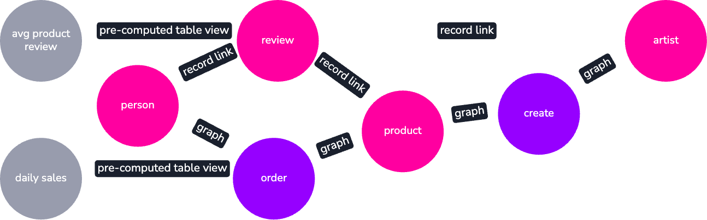

# Demo Data

  

# Demo Data

  

To quickly test out SurrealDB and SurrealQL functionality, we've included demo data here in `.surql` files which you can download and [`import`](/docs/cli/import) into SurrealDB using the CLI

## Surreal Deal - deals so good it's surreal!

[Surreal Deal](https://drive.google.com/uc?id=1AlSMBJrncEuqOtbbEXLqtenUb0Z5BjlD&export=download) is a demo dataset based on a simplified e-commerce platform that sells artwork.
The dataset is made up of 8 tables using both [graph relations](/docs/surrealql/statements/relate) and [record links](/docs/surrealql/datamodel/records):
`person`, `order`, `product`, `review`, `artist`, `create`, `avg_product_review`, `daily_sales`.

In the diagram below, the nodes in pink are the [standard tables](/docs/surrealql/statements/define/table), the ones in purple represent the [edge tables](/docs/surrealql/statements/relate) which shows relationships between records and SurrealDB as a graph database. While the nodes in gray are the [pre-computed table views](/docs/surrealql/statements/define/table).

## Download and import

[Download the dataset here](https://drive.google.com/uc?id=1AlSMBJrncEuqOtbbEXLqtenUb0Z5BjlD&export=download), then [start the server](/docs/cli/start) and use the [import command](/docs/cli/import) to add the dataset from your "Downloads" folder. Please be aware that the import process might take a few seconds.
